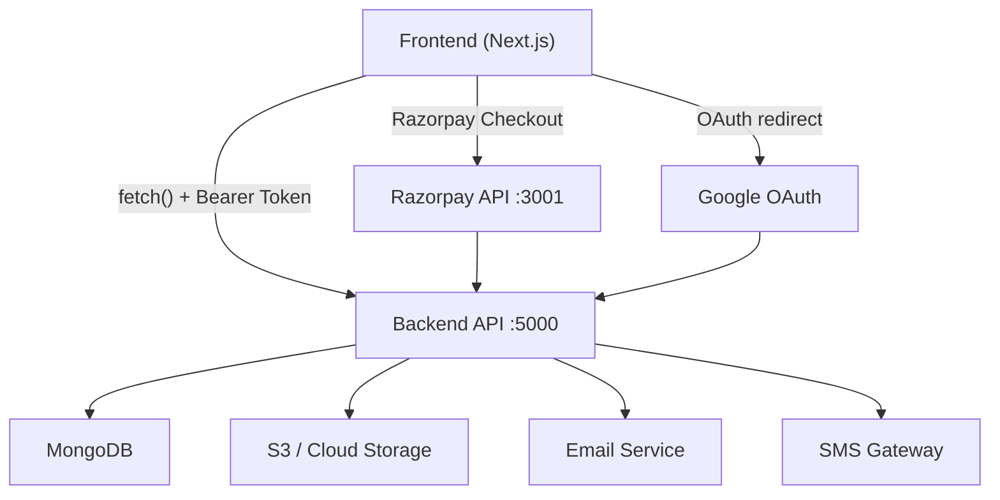
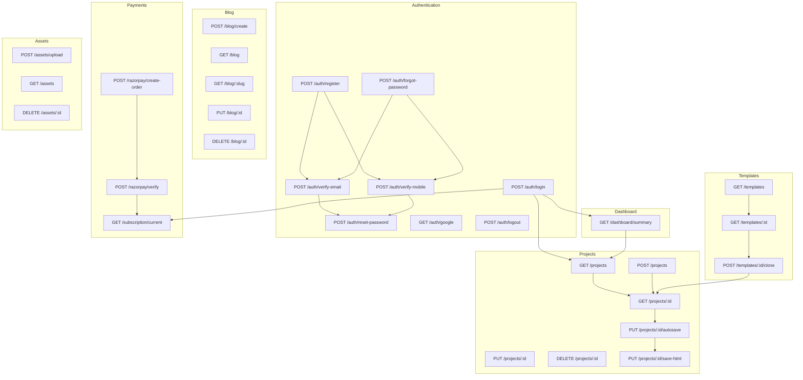

# Stackly — Backend API Requirements Document

> **Generated**: 2026-07-09  
> **Source**: Full frontend codebase analysis (`Website-Builder-Application/frontend`)  
> **Framework**: Next.js 14 (App Router) • Zustand state management  
> **API Base URL**: `NEXT_PUBLIC_API_BASE_URL` → default `http://localhost:5000/api`  
> **Auth Token Storage**: `localStorage["stackly-auth-token"]` → sent as `Authorization: Bearer <token>`

---

## Table of Contents

1. [Architecture Overview](#1-architecture-overview)
2. [Global API Conventions](#2-global-api-conventions)
3. [Authentication APIs](#3-authentication-apis)
4. [Dashboard APIs](#4-dashboard-apis)
5. [Project APIs](#5-project-apis)
6. [Builder APIs](#6-builder-apis)
7. [Template APIs](#7-template-apis)
8. [Asset APIs](#8-asset-apis)
9. [Blog APIs](#9-blog-apis)
10. [Publishing APIs](#10-publishing-apis)
11. [Domain APIs](#11-domain-apis)
12. [Analytics APIs](#12-analytics-apis)
13. [Account & Settings APIs](#13-account--settings-apis)
14. [Subscription & Payment APIs](#14-subscription--payment-apis)
15. [Notification APIs](#15-notification-apis)
16. [Search APIs](#16-search-apis)
17. [Contact APIs](#17-contact-apis)
18. [Admin APIs](#18-admin-apis)
19. [API Dependency Diagram](#19-api-dependency-diagram)
20. [Gap Analysis](#20-gap-analysis)
21. [Priority Summary](#21-priority-summary)
22. [Backend Development Checklist](#22-backend-development-checklist)

---

## 1. Architecture Overview



### Frontend API Clients

| File | Responsibility |
|------|---------------|
| `lib/api.ts` | Authentication endpoints (login, register, OTP, password reset, contact) |
| `lib/projectApi.ts` | Project CRUD, autosave, HTML save |
| `lib/templateApi.ts` | Template listing, detail, clone |
| `lib/blogApi.ts` | Blog CRUD |
| `lib/googleAuth.ts` | Google OAuth URL builder (redirects to backend) |
| `lib/razorpayClient.ts` | Razorpay order creation & payment verification |
| `lib/analytics.ts` | **localStorage-only** (no backend yet — needs migration) |
| `lib/userSettings.ts` | **localStorage-only** (no backend yet — needs migration) |
| `lib/assetDb.ts` | **IndexedDB-only** (no backend yet — needs migration to S3) |

### Zustand Stores

| Store | Backend Interaction |
|-------|--------------------|
| `store/projectStore.ts` | Calls `projectApi.ts` for all project operations |
| `store/builderStore.ts` | Calls `projectApi.ts` (getProject, autosaveProject, saveHtml) |
| `store/assetStore.ts` | IndexedDB only — **needs S3 backend migration** |
| `store/designStore.ts` | localStorage only — persisted via builderData in project save |
| `store/builderUiStore.ts` | localStorage only — UI preferences, no backend needed |

---

## 2. Global API Conventions

### Base URL

```
{NEXT_PUBLIC_API_BASE_URL} = http://localhost:5000/api
```

### Authentication Header

```http
Authorization: Bearer <jwt-token>
```

Token is stored in `localStorage["stackly-auth-token"]` and attached to requests via the `authHeaders()` helper in each API client.

### Standard Error Response

```json
{
  "message": "Human-readable error message",
  "errors": ["Field-level validation error 1", "Field-level validation error 2"],
  "attemptsLeft": 3
}
```

> `attemptsLeft` is only present on OTP verification error responses.

### Standard Status Codes

| Code | Meaning |
|------|---------|
| `200` | Success |
| `201` | Created |
| `400` | Validation error / Bad request |
| `401` | Unauthorized (token missing or expired) |
| `403` | Forbidden (insufficient permissions) |
| `404` | Resource not found |
| `409` | Conflict (duplicate resource) |
| `429` | Rate limited |
| `500` | Internal server error |

### Content Type

All requests and responses use `Content-Type: application/json` unless noted otherwise (e.g., file uploads use `multipart/form-data`).

---

## 3. Authentication APIs

### 3.1 POST `/api/auth/register`

| Field | Value |
|-------|-------|
| **Purpose** | Register a new user account |
| **Auth Required** | No |
| **Priority** | 🔴 Critical |
| **Frontend Files** | `lib/api.ts`, `app/signup/page.tsx` |

**Request Body:**

```json
{
  "name": "string (required)",
  "email": "string (required, valid email)",
  "mobile": "string (required, with country code)",
  "password": "string (required, min 8 chars, uppercase + lowercase + number + special)",
  "confirmPassword": "string (required, must match password)"
}
```

**Validation Rules:**
- `name`: 2–50 characters
- `email`: valid email format, unique in system
- `mobile`: valid phone number with country code (e.g., `+91XXXXXXXXXX`)
- `password`: minimum 8 characters, at least 1 uppercase, 1 lowercase, 1 digit, 1 special character
- `confirmPassword`: must exactly match `password`

**Success Response (201):**

```json
{
  "message": "Registration successful. Please verify your email.",
  "user": {
    "_id": "string",
    "name": "string",
    "email": "string",
    "mobile": "string"
  }
}
```

**Error Response (400):**

```json
{
  "message": "Email already registered",
  "errors": ["Email is already in use"]
}
```

**Status Codes:** `201`, `400`, `409`, `500`

---

### 3.2 POST `/api/auth/login`

| Field | Value |
|-------|-------|
| **Purpose** | User login with email/mobile + password |
| **Auth Required** | No |
| **Priority** | 🔴 Critical |
| **Frontend Files** | `lib/api.ts`, `app/login/page.tsx` |
| **Stores** | Token stored in `localStorage["stackly-auth-token"]` |

**Request Body:**

```json
{
  "email": "string (optional, provide email OR mobile)",
  "mobile": "string (optional, provide email OR mobile)",
  "password": "string (required)"
}
```

> Frontend sends either `email` or `mobile`, never both.

**Success Response (200):**

```json
{
  "token": "jwt-string",
  "message": "Login successful",
  "userType": "free | premium | admin"
}
```

**Error Response (401):**

```json
{
  "message": "Invalid email or password"
}
```

**Status Codes:** `200`, `400`, `401`, `500`

---

### 3.3 POST `/api/auth/forgot-password`

| Field | Value |
|-------|-------|
| **Purpose** | Initiate password reset flow |
| **Auth Required** | No |
| **Priority** | 🟡 Required |
| **Frontend Files** | `lib/api.ts`, `app/forgot-password/page.tsx` |

**Request Body:**

```json
{
  "input": "string (email or mobile)",
  "isChange": "boolean (optional, true if changing from settings)",
  "primaryUser": "string (optional, current user email for change-password flow)"
}
```

**Success Response (200):**

```json
{
  "message": "OTP sent to your email/mobile",
  "otp": "string (DEV ONLY — remove in production)",
  "moveToVerify": true
}
```

**Status Codes:** `200`, `400`, `404`, `429`, `500`

---

### 3.4 POST `/api/auth/verify-email`

| Field | Value |
|-------|-------|
| **Purpose** | Verify email via OTP |
| **Auth Required** | No |
| **Priority** | 🟡 Required |
| **Frontend Files** | `lib/api.ts`, `app/verify-email/page.tsx` |

**Request Body:**

```json
{
  "email": "string (required)",
  "otp": "string (6-digit code, required for verify)",
  "action": "\"resend\" (optional, to resend OTP)"
}
```

**Success Response — Verify (200):**

```json
{
  "token": "jwt-string",
  "message": "Email verified successfully"
}
```

**Success Response — Resend (200):**

```json
{
  "message": "OTP resent to your email",
  "otp": "string (DEV ONLY)"
}
```

**Error Response (400):**

```json
{
  "message": "Invalid OTP",
  "attemptsLeft": 2
}
```

**Status Codes:** `200`, `400`, `429`, `500`

---

### 3.5 POST `/api/auth/verify-mobile`

| Field | Value |
|-------|-------|
| **Purpose** | Verify mobile number via OTP |
| **Auth Required** | No |
| **Priority** | 🟡 Required |
| **Frontend Files** | `lib/api.ts`, `app/verify-mobile/page.tsx` |

**Request Body:**

```json
{
  "mobile": "string (required, with country code)",
  "otp": "string (6-digit code, required for verify)",
  "action": "\"resend\" (optional, to resend OTP)"
}
```

**Success Response — Verify (200):**

```json
{
  "token": "jwt-string",
  "message": "Mobile verified successfully"
}
```

**Error Response (400):**

```json
{
  "message": "Invalid OTP",
  "attemptsLeft": 2
}
```

**Status Codes:** `200`, `400`, `429`, `500`

---

### 3.6 POST `/api/auth/reset-password`

| Field | Value |
|-------|-------|
| **Purpose** | Reset password using token from OTP verification |
| **Auth Required** | Yes (Bearer token from verify step) |
| **Priority** | 🟡 Required |
| **Frontend Files** | `lib/api.ts`, `app/create-new-password/page.tsx` |

**Request Headers:**

```http
Authorization: Bearer <reset-token-from-verify>
```

**Request Body:**

```json
{
  "newPassword": "string (required, same validation as registration)",
  "confirmPassword": "string (required, must match)"
}
```

**Success Response (200):**

```json
{
  "message": "Password reset successfully"
}
```

**Status Codes:** `200`, `400`, `401`, `500`

---

### 3.7 GET `/api/auth/google`

| Field | Value |
|-------|-------|
| **Purpose** | Google OAuth callback endpoint |
| **Auth Required** | No (Google provides auth code) |
| **Priority** | 🟢 Nice-to-have |
| **Frontend Files** | `lib/googleAuth.ts`, `components/AuthGoogleButton.tsx` |

**Flow:**
1. Frontend builds Google OAuth URL via `buildGoogleOAuthUrl("login" | "signup")`
2. User is redirected to Google consent screen
3. Google redirects to `{API_BASE_URL}/auth/google?code=...&state=login|signup`
4. Backend exchanges code for Google profile
5. Backend creates/finds user, generates JWT
6. Backend redirects to frontend: `/{landing}?token=<jwt>`

**Query Parameters:**

| Param | Type | Description |
|-------|------|-------------|
| `code` | string | Authorization code from Google |
| `state` | string | `"login"` or `"signup"` |

**Backend Redirect:**

```
302 → {FRONTEND_URL}/landing?token=<jwt>
```

---

### 3.8 POST `/api/auth/logout` *(NEW — Required)*

| Field | Value |
|-------|-------|
| **Purpose** | Invalidate the current JWT / session |
| **Auth Required** | Yes |
| **Priority** | 🟡 Required |
| **Frontend Files** | `components/app-shell/Topbar.tsx`, `app/dashboard/settings/page.tsx` |
| **Notes** | Frontend currently just removes `localStorage["stackly-auth-token"]`. Backend should invalidate the token. |

**Request:** Empty body

**Success Response (200):**

```json
{
  "message": "Logged out successfully"
}
```

---

### 3.9 POST `/api/auth/refresh-token` *(NEW — Recommended)*

| Field | Value |
|-------|-------|
| **Purpose** | Refresh an expiring JWT without re-login |
| **Auth Required** | Yes (current token) |
| **Priority** | 🟢 Nice-to-have |
| **Notes** | Frontend does not implement this yet. Add when token expiry is enforced. |

**Request Body:**

```json
{
  "refreshToken": "string"
}
```

**Success Response (200):**

```json
{
  "token": "new-jwt-string",
  "refreshToken": "new-refresh-token"
}
```

---

## 4. Dashboard APIs

### 4.1 GET `/api/dashboard/summary` *(NEW — Required)*

| Field | Value |
|-------|-------|
| **Purpose** | Aggregate stats for the dashboard home |
| **Auth Required** | Yes |
| **Priority** | 🟡 Required |
| **Frontend Files** | `app/dashboard/page.tsx`, `components/dashboard/StatsCards.tsx` |
| **Notes** | Frontend currently counts projects client-side. Backend aggregation is more reliable. |

**Success Response (200):**

```json
{
  "success": true,
  "stats": {
    "totalProjects": 12,
    "publishedProjects": 5,
    "draftProjects": 7,
    "totalViews": 1543,
    "storageUsedMB": 45.2,
    "plan": "Pro"
  },
  "recentProjects": [
    {
      "_id": "abc123",
      "projectName": "My Portfolio",
      "updatedAt": "2026-07-08T12:00:00Z",
      "status": "published",
      "thumbnail": "https://..."
    }
  ],
  "recentActivity": [
    {
      "type": "project_updated",
      "projectId": "abc123",
      "projectName": "My Portfolio",
      "timestamp": "2026-07-08T12:00:00Z"
    }
  ]
}
```

---

## 5. Project APIs

### 5.1 GET `/api/projects`

| Field | Value |
|-------|-------|
| **Purpose** | List all projects for the authenticated user |
| **Auth Required** | Yes |
| **Priority** | 🔴 Critical |
| **Frontend Files** | `lib/projectApi.ts`, `store/projectStore.ts`, `app/dashboard/page.tsx` |

**Query Parameters:**

| Param | Type | Required | Description |
|-------|------|----------|-------------|
| `search` | string | No | Filter by project name |
| `sort` | string | No | `updatedAt`, `createdAt`, `name` |
| `order` | string | No | `asc`, `desc` (default: `desc`) |
| `status` | string | No | `draft`, `published`, `archived` |
| `page` | number | No | Pagination page (default: 1) |
| `limit` | number | No | Items per page (default: 50) |

**Success Response (200):**

```json
{
  "success": true,
  "projects": [
    {
      "_id": "64f1a2b3c4d5e6f7a8b9c0d1",
      "projectName": "My Portfolio Website",
      "description": "A clean portfolio site",
      "category": "Portfolio",
      "style": "Modern",
      "sections": ["navigation", "hero", "gallery", "contact"],
      "status": "draft",
      "createdAt": "2026-07-01T10:00:00Z",
      "updatedAt": "2026-07-08T14:30:00Z"
    }
  ],
  "total": 12,
  "page": 1,
  "totalPages": 1
}
```

> **Note:** The list endpoint should NOT return `builderData` or `htmlContent` (too large). These are fetched per-project via GET `/api/projects/:id`.

---

### 5.2 GET `/api/projects/:id`

| Field | Value |
|-------|-------|
| **Purpose** | Get a single project with full builder data |
| **Auth Required** | Yes |
| **Priority** | 🔴 Critical |
| **Frontend Files** | `lib/projectApi.ts`, `store/builderStore.ts` (loadProject) |
| **Path Params** | `id` — Project MongoDB ObjectId |

**Success Response (200):**

```json
{
  "success": true,
  "project": {
    "_id": "64f1a2b3c4d5e6f7a8b9c0d1",
    "projectName": "My Portfolio",
    "description": "A clean portfolio site",
    "category": "Portfolio",
    "style": "Modern",
    "sections": ["navigation", "hero", "gallery", "contact"],
    "status": "draft",
    "builderData": {
      "schemaVersion": 1,
      "components": [],
      "designTokens": {
        "colors": { "primary": "#0B1D40", "secondary": "#3b82f6", "accent": "#f59e0b", "background": "#ffffff", "text": "#0B1D40" },
        "typography": { "fontFamily": "Inter, system-ui, sans-serif", "baseFontSize": "16px", "headingScale": 1.25 },
        "buttons": { "borderRadius": "8px", "fontWeight": "700" },
        "spacing": { "base": 8 }
      },
      "seo": {
        "title": "My Portfolio – Built with Stackly",
        "description": "A beautiful portfolio website.",
        "ogTitle": "",
        "ogDescription": "",
        "ogImage": ""
      },
      "canvasMode": "flow",
      "projectName": "My Portfolio"
    },
    "htmlContent": "<!DOCTYPE html><html>...</html>",
    "createdAt": "2026-07-01T10:00:00Z",
    "updatedAt": "2026-07-08T14:30:00Z"
  }
}
```

---

### 5.3 POST `/api/projects`

| Field | Value |
|-------|-------|
| **Purpose** | Create a new project |
| **Auth Required** | Yes |
| **Priority** | 🔴 Critical |
| **Frontend Files** | `lib/projectApi.ts`, `store/projectStore.ts`, `components/CreateProjectFlow.tsx`, `components/dashboard/CreateProjectModal.tsx` |

**Request Body:**

```json
{
  "projectName": "string (required, 1-100 chars)",
  "category": "string (optional: Business, Portfolio, Blog, E-commerce, Restaurant)",
  "style": "string (optional: Modern, Bold, Minimal)",
  "sections": ["navigation", "hero", "features", "contact"],
  "description": "string (optional)"
}
```

**Success Response (201):**

```json
{
  "success": true,
  "project": {
    "_id": "64f1a2b3c4d5e6f7a8b9c0d1",
    "projectName": "My New Site",
    "category": "Business",
    "style": "Modern",
    "sections": ["navigation", "hero", "features", "contact"],
    "status": "draft",
    "createdAt": "2026-07-09T08:00:00Z",
    "updatedAt": "2026-07-09T08:00:00Z"
  }
}
```

---

### 5.4 PUT `/api/projects/:id`

| Field | Value |
|-------|-------|
| **Purpose** | Update project metadata (name, description, status, etc.) |
| **Auth Required** | Yes |
| **Priority** | 🔴 Critical |
| **Frontend Files** | `lib/projectApi.ts`, `store/projectStore.ts` (renameProject), `components/dashboard/ProjectSettingsForm.tsx` |
| **Path Params** | `id` — Project ObjectId |

**Request Body (all fields optional):**

```json
{
  "projectName": "string",
  "description": "string",
  "category": "string",
  "style": "string",
  "sections": ["string"],
  "status": "draft | published | archived"
}
```

**Success Response (200):**

```json
{
  "success": true,
  "project": {}
}
```

---

### 5.5 DELETE `/api/projects/:id`

| Field | Value |
|-------|-------|
| **Purpose** | Delete a project permanently |
| **Auth Required** | Yes |
| **Priority** | 🔴 Critical |
| **Frontend Files** | `lib/projectApi.ts`, `store/projectStore.ts`, `components/dashboard/ProjectCard.tsx` |
| **Path Params** | `id` — Project ObjectId |

**Success Response (200):**

```json
{
  "success": true,
  "message": "Project deleted"
}
```

---

### 5.6 PUT `/api/projects/:id/autosave`

| Field | Value |
|-------|-------|
| **Purpose** | Save the builder state (components + rendered HTML) for a project |
| **Auth Required** | Yes |
| **Priority** | 🔴 Critical |
| **Frontend Files** | `lib/projectApi.ts`, `store/builderStore.ts` (autosave) |
| **Path Params** | `id` — Project ObjectId |
| **Notes** | Called automatically on builder changes. Must be idempotent and fast. |

**Request Body:**

```json
{
  "builderData": {
    "schemaVersion": 1,
    "components": [],
    "sections": [],
    "designTokens": {},
    "seo": {},
    "canvasMode": "flow | freeform",
    "projectName": "string"
  },
  "htmlContent": "string (full rendered HTML document)"
}
```

> **Size Note:** `builderData` can be 500KB–5MB for complex projects. `htmlContent` can be 200KB–2MB. The endpoint must handle large payloads efficiently.

**Success Response (200):**

```json
{
  "success": true,
  "savedAt": "2026-07-09T08:15:00Z"
}
```

---

### 5.7 PUT `/api/projects/:id/save-html`

| Field | Value |
|-------|-------|
| **Purpose** | Save only the rendered HTML (used for explicit "Save HTML" action) |
| **Auth Required** | Yes |
| **Priority** | 🟡 Required |
| **Frontend Files** | `lib/projectApi.ts`, `store/builderStore.ts` (saveHtml) |
| **Path Params** | `id` — Project ObjectId |

**Request Body:**

```json
{
  "htmlContent": "string (full rendered HTML document)"
}
```

**Success Response (200):**

```json
{
  "success": true,
  "savedAt": "2026-07-09T08:15:00Z"
}
```

---

## 6. Builder APIs

> **Note:** Most builder operations (add/delete/update/reorder components, undo/redo, etc.) are handled entirely client-side in `builderStore.ts`. The backend's role is to **persist** and **restore** builder state via the Project APIs (§5.6 autosave and §5.2 getProject). The endpoints below are builder-specific backend needs.

### 6.1 Project Load → GET `/api/projects/:id`

Already covered in §5.2. Builder loads project via `builderStore.loadProject(id)`.

### 6.2 Project Save → PUT `/api/projects/:id/autosave`

Already covered in §5.6. Builder autosaves via `builderStore.autosave()`.

### 6.3 HTML Save → PUT `/api/projects/:id/save-html`

Already covered in §5.7. Used for explicit HTML generation save.

### 6.4 Export/Import JSON

Handled entirely client-side via `lib/jsonExportImport.ts`. No backend endpoint needed — users download/upload `.json` files directly in the browser.

### 6.5 Export HTML

Handled entirely client-side via `lib/exportHtml.ts`. Generates a self-contained HTML document in the browser and triggers download.

### 6.6 POST `/api/projects/:id/versions` *(NEW — Future)*

| Field | Value |
|-------|-------|
| **Purpose** | Create a named version snapshot for version history |
| **Auth Required** | Yes |
| **Priority** | 🔵 Future |
| **Notes** | Frontend has undo/redo in-memory but no persistent version history yet |

**Request Body:**

```json
{
  "label": "string (optional, e.g., 'Before redesign')",
  "builderData": {},
  "htmlContent": "string"
}
```

**Success Response (201):**

```json
{
  "success": true,
  "version": {
    "_id": "string",
    "label": "string",
    "createdAt": "2026-07-09T08:20:00Z"
  }
}
```

### 6.7 GET `/api/projects/:id/versions` *(NEW — Future)*

| Field | Value |
|-------|-------|
| **Purpose** | List version snapshots for a project |
| **Auth Required** | Yes |
| **Priority** | 🔵 Future |

**Success Response (200):**

```json
{
  "success": true,
  "versions": [
    { "_id": "v1", "label": "Initial", "createdAt": "..." },
    { "_id": "v2", "label": "Before redesign", "createdAt": "..." }
  ]
}
```

---

## 7. Template APIs

### 7.1 GET `/api/templates`

| Field | Value |
|-------|-------|
| **Purpose** | List all templates, optionally filtered |
| **Auth Required** | No (public) |
| **Priority** | 🔴 Critical |
| **Frontend Files** | `lib/templateApi.ts`, `app/templates/page.tsx` |

**Query Parameters:**

| Param | Type | Required | Description |
|-------|------|----------|-------------|
| `category` | string | No | `Portfolio`, `Blog`, `E-Commerce`, `Restaurant`, `Construction` |
| `search` | string | No | Search by name or description |
| `isPremium` | boolean | No | Filter free vs premium templates |

**Success Response (200):**

```json
{
  "success": true,
  "templates": [
    {
      "_id": "tmpl_001",
      "name": "Creative Portfolio",
      "slug": "creative-portfolio",
      "category": "Portfolio",
      "style": "Modern",
      "description": "A sleek portfolio for creatives",
      "thumbnail": "/templates/creative-portfolio.webp",
      "isPremium": false,
      "tags": ["portfolio", "creative", "minimal"],
      "usageCount": 1234,
      "createdAt": "2026-01-15T00:00:00Z"
    }
  ]
}
```

---

### 7.2 GET `/api/templates/:id`

| Field | Value |
|-------|-------|
| **Purpose** | Get a single template with full builder data for preview |
| **Auth Required** | No (public) |
| **Priority** | 🔴 Critical |
| **Frontend Files** | `lib/templateApi.ts`, `app/templates/preview/TemplatePreviewClient.tsx` |
| **Path Params** | `id` — Template ObjectId |

**Success Response (200):**

```json
{
  "success": true,
  "template": {
    "_id": "tmpl_001",
    "name": "Creative Portfolio",
    "slug": "creative-portfolio",
    "category": "Portfolio",
    "style": "Modern",
    "description": "...",
    "thumbnail": "...",
    "isPremium": false,
    "tags": ["portfolio"],
    "usageCount": 1234,
    "createdAt": "...",
    "sections": ["navigation", "hero", "gallery", "contact"],
    "builderData": {
      "schemaVersion": 1,
      "components": [],
      "designTokens": {},
      "seo": {}
    }
  }
}
```

---

### 7.3 POST `/api/templates/:id/clone`

| Field | Value |
|-------|-------|
| **Purpose** | Clone a template into a new user project |
| **Auth Required** | Yes |
| **Priority** | 🔴 Critical |
| **Frontend Files** | `lib/templateApi.ts`, `app/templates/page.tsx`, `app/templates/preview/TemplatePreviewClient.tsx` |
| **Path Params** | `id` — Template ObjectId |

**Request Body:** Empty (template ID is in the path)

**Success Response (201):**

```json
{
  "success": true,
  "projectId": "64f1a2b3c4d5e6f7a8b9c0d1"
}
```

> Backend should:
> 1. Copy template's `builderData` into a new project document
> 2. Set project owner to the authenticated user
> 3. Increment `usageCount` on the template
> 4. Return the new project `_id`

---

## 8. Asset APIs

> **Current State:** Assets are stored in IndexedDB via `lib/assetDb.ts` with blob storage. The `assetStore.ts` comments explicitly mention migration to S3/cloud as the intended path.

### 8.1 POST `/api/assets/upload` *(NEW — Required)*

| Field | Value |
|-------|-------|
| **Purpose** | Upload image assets to cloud storage |
| **Auth Required** | Yes |
| **Priority** | 🟡 Required |
| **Frontend Files** | `store/assetStore.ts` (uploadFiles), `components/assets/AssetManager.tsx`, `components/assets/DropZone.tsx` |
| **Content-Type** | `multipart/form-data` |

**Request:** `multipart/form-data`

| Field | Type | Description |
|-------|------|-------------|
| `files` | File[] | One or more image files |
| `projectId` | string | (optional) Associate with a project |

**Accepted MIME types:** `image/png`, `image/jpeg`, `image/webp`, `image/gif`, `image/svg+xml`, `image/avif`

**Success Response (201):**

```json
{
  "success": true,
  "assets": [
    {
      "id": "asset_uuid",
      "name": "hero-bg.webp",
      "mimeType": "image/webp",
      "size": 245760,
      "width": 1920,
      "height": 1080,
      "url": "https://cdn.stackly.com/assets/asset_uuid.webp",
      "thumbnail": "https://cdn.stackly.com/assets/asset_uuid_thumb.webp",
      "uploadedAt": 1720512000000,
      "tags": []
    }
  ]
}
```

---

### 8.2 GET `/api/assets` *(NEW — Required)*

| Field | Value |
|-------|-------|
| **Purpose** | List all assets for the authenticated user |
| **Auth Required** | Yes |
| **Priority** | 🟡 Required |
| **Frontend Files** | `store/assetStore.ts` (loadAssets), `components/assets/AssetManager.tsx`, `components/assets/ImagePicker.tsx` |

**Query Parameters:**

| Param | Type | Description |
|-------|------|-------------|
| `projectId` | string | (optional) Filter by project |
| `search` | string | (optional) Search by file name |

**Success Response (200):**

```json
{
  "success": true,
  "assets": []
}
```

---

### 8.3 DELETE `/api/assets/:id` *(NEW — Required)*

| Field | Value |
|-------|-------|
| **Purpose** | Delete an uploaded asset |
| **Auth Required** | Yes |
| **Priority** | 🟡 Required |
| **Frontend Files** | `store/assetStore.ts` (deleteAsset), `components/assets/AssetCard.tsx` |

**Success Response (200):**

```json
{
  "success": true,
  "message": "Asset deleted"
}
```

---

### 8.4 GET `/api/assets/:id/url` *(NEW — Required)*

| Field | Value |
|-------|-------|
| **Purpose** | Get a signed/public URL for an asset (replaces IndexedDB blob lookup) |
| **Auth Required** | Yes |
| **Priority** | 🟡 Required |
| **Frontend Files** | `store/assetStore.ts` (getUrl, getDataUrl) |

**Success Response (200):**

```json
{
  "url": "https://cdn.stackly.com/assets/asset_uuid.webp",
  "expiresAt": "2026-07-09T09:00:00Z"
}
```

---

## 9. Blog APIs

### 9.1 POST `/api/blog/create`

| Field | Value |
|-------|-------|
| **Purpose** | Create a new blog post |
| **Auth Required** | Yes |
| **Priority** | 🟡 Required |
| **Frontend Files** | `lib/blogApi.ts`, `app/blog/page.tsx` |

**Request Body:**

```json
{
  "title": "string (required)",
  "content": "string (required, HTML or markdown)",
  "seoTitle": "string (optional)",
  "seoDescription": "string (optional)",
  "seoKeywords": ["string"],
  "status": "draft | published (optional, default: draft)",
  "featuredImage": "string (optional, URL)"
}
```

**Success Response (201):**

```json
{
  "message": "Blog created successfully",
  "blog": {
    "_id": "blog_001",
    "title": "My First Post",
    "slug": "my-first-post",
    "content": "...",
    "status": "draft",
    "createdAt": "2026-07-09T08:00:00Z",
    "updatedAt": "2026-07-09T08:00:00Z"
  }
}
```

---

### 9.2 GET `/api/blog`

| Field | Value |
|-------|-------|
| **Purpose** | List all blog posts for the authenticated user |
| **Auth Required** | Yes |
| **Priority** | 🟡 Required |
| **Frontend Files** | `lib/blogApi.ts`, `app/blog/page.tsx` |

**Success Response (200):**

```json
{
  "blogs": [
    {
      "_id": "blog_001",
      "title": "My First Post",
      "slug": "my-first-post",
      "status": "published",
      "createdAt": "2026-07-09T08:00:00Z"
    }
  ]
}
```

> **Note:** Frontend handles both `BlogListItem[]` (raw array) and `{ blogs: BlogListItem[] }` wrapper formats. Backend should return the wrapper format for consistency.

---

### 9.3 GET `/api/blog/:slug`

| Field | Value |
|-------|-------|
| **Purpose** | Get a single blog post by slug |
| **Auth Required** | No (public for published, Yes for drafts) |
| **Priority** | 🟡 Required |
| **Frontend Files** | `lib/blogApi.ts`, `app/blog/[slug]/page.tsx` |
| **Path Params** | `slug` — Blog post slug |

**Success Response (200):**

```json
{
  "_id": "blog_001",
  "title": "My First Post",
  "slug": "my-first-post",
  "content": "<h1>Hello World</h1><p>...</p>",
  "seoTitle": "My First Post | Stackly Blog",
  "seoDescription": "...",
  "seoKeywords": ["web", "design"],
  "status": "published",
  "featuredImage": "https://...",
  "createdAt": "2026-07-09T08:00:00Z",
  "updatedAt": "2026-07-09T10:00:00Z"
}
```

---

### 9.4 PUT `/api/blog/:id`

| Field | Value |
|-------|-------|
| **Purpose** | Update a blog post |
| **Auth Required** | Yes |
| **Priority** | 🟡 Required |
| **Frontend Files** | `lib/blogApi.ts`, `app/blog/page.tsx` |
| **Path Params** | `id` — Blog ObjectId |

**Request Body (all fields optional):**

```json
{
  "title": "string",
  "content": "string",
  "seoTitle": "string",
  "seoDescription": "string",
  "seoKeywords": ["string"],
  "status": "draft | published",
  "featuredImage": "string"
}
```

**Success Response (200):**

```json
{
  "message": "Blog updated",
  "blog": {}
}
```

---

### 9.5 DELETE `/api/blog/:id`

| Field | Value |
|-------|-------|
| **Purpose** | Delete a blog post |
| **Auth Required** | Yes |
| **Priority** | 🟡 Required |
| **Frontend Files** | `lib/blogApi.ts`, `app/blog/page.tsx` |
| **Path Params** | `id` — Blog ObjectId |

**Success Response (200):**

```json
{
  "message": "Blog deleted"
}
```

---

## 10. Publishing APIs

> **Current State:** No publishing endpoints exist in the frontend yet. The frontend generates HTML client-side and saves it via the autosave endpoint. The following APIs are needed for full hosting/deployment.

### 10.1 POST `/api/projects/:id/publish` *(NEW — Required)*

| Field | Value |
|-------|-------|
| **Purpose** | Publish a project to a live URL |
| **Auth Required** | Yes |
| **Priority** | 🟡 Required |

**Request Body:**

```json
{
  "subdomain": "string (optional, auto-generated if not provided)",
  "customDomain": "string (optional)"
}
```

**Success Response (200):**

```json
{
  "success": true,
  "deployment": {
    "id": "deploy_001",
    "url": "https://mysite.stackly.app",
    "status": "live",
    "publishedAt": "2026-07-09T09:00:00Z"
  }
}
```

### 10.2 GET `/api/projects/:id/publish/status` *(NEW — Required)*

| Field | Value |
|-------|-------|
| **Purpose** | Check deployment status |
| **Auth Required** | Yes |
| **Priority** | 🟡 Required |

**Success Response (200):**

```json
{
  "success": true,
  "status": "live | deploying | failed",
  "url": "https://mysite.stackly.app",
  "lastPublishedAt": "2026-07-09T09:00:00Z"
}
```

### 10.3 GET `/api/projects/:id/publish/history` *(NEW — Future)*

| Field | Value |
|-------|-------|
| **Purpose** | List deployment history for rollback |
| **Auth Required** | Yes |
| **Priority** | 🔵 Future |

### 10.4 POST `/api/projects/:id/publish/rollback` *(NEW — Future)*

| Field | Value |
|-------|-------|
| **Purpose** | Rollback to a previous deployment |
| **Auth Required** | Yes |
| **Priority** | 🔵 Future |

---

## 11. Domain APIs

> **Current State:** No domain management exists in the frontend. These are future APIs.

### 11.1 POST `/api/domains/generate-subdomain` *(NEW — Future)*

**Purpose:** Auto-generate a unique `*.stackly.app` subdomain

### 11.2 POST `/api/domains/custom` *(NEW — Future)*

**Purpose:** Attach a custom domain to a project

### 11.3 GET `/api/domains/:id/verify` *(NEW — Future)*

**Purpose:** Verify DNS configuration for a custom domain

### 11.4 DELETE `/api/domains/:id` *(NEW — Future)*

**Purpose:** Remove a custom domain

---

## 12. Analytics APIs

> **Current State:** Analytics are **entirely localStorage-based** (`lib/analytics.ts`). All tracking and aggregation runs in the browser. For production, this needs to migrate to backend-tracked events.

### 12.1 POST `/api/analytics/event` *(NEW — Required)*

| Field | Value |
|-------|-------|
| **Purpose** | Track a page view or visitor event |
| **Auth Required** | No (tracked via session/visitor ID) |
| **Priority** | 🟡 Required |
| **Frontend Files** | `lib/analytics.ts` (trackPageView, trackVisitor) |

**Request Body:**

```json
{
  "projectId": "string (the published site ID)",
  "page": "string (URL path)",
  "sessionId": "string (UUID)",
  "timestamp": 1720512000000,
  "userAgent": "string (optional)",
  "referrer": "string (optional)",
  "country": "string (optional, resolved server-side from IP)"
}
```

### 12.2 GET `/api/analytics/:projectId` *(NEW — Required)*

| Field | Value |
|-------|-------|
| **Purpose** | Get aggregated analytics for a project |
| **Auth Required** | Yes |
| **Priority** | 🟡 Required |
| **Frontend Files** | `lib/analytics.ts` (getAnalyticsData), `app/dashboard/analytics/page.tsx`, all analytics components |

**Query Parameters:**

| Param | Type | Description |
|-------|------|-------------|
| `filter` | string | `today`, `7days`, `30days` |

**Success Response (200):**

```json
{
  "success": true,
  "data": {
    "totalViews": 1543,
    "uniqueVisitors": 324,
    "todayViews": 45,
    "weeklyViews": 456,
    "dailyTraffic": [
      { "date": "Jul 8", "views": 67, "visitors": 23 }
    ],
    "weeklyTraffic": [
      { "week": "Week of Jul 1", "views": 312, "visitors": 89 }
    ],
    "topPages": [
      { "page": "/", "views": 543, "percentage": 35 }
    ],
    "recentActivity": [
      { "id": "evt_001", "page": "/about", "timestamp": 1720512000000, "sessionId": "..." }
    ]
  }
}
```

---

## 13. Account & Settings APIs

> **Current State:** User settings (name, email, avatar) are stored in `localStorage` via `lib/userSettings.ts`. These need backend persistence.

### 13.1 GET `/api/user/profile` *(NEW — Required)*

| Field | Value |
|-------|-------|
| **Purpose** | Get current user's profile |
| **Auth Required** | Yes |
| **Priority** | 🟡 Required |
| **Frontend Files** | `lib/userSettings.ts`, `app/dashboard/settings/page.tsx`, `components/dashboard/ProfileSettingsPanel.tsx` |

**Success Response (200):**

```json
{
  "success": true,
  "user": {
    "_id": "user_001",
    "name": "Stackly User",
    "email": "user@stackly.com",
    "mobile": "+91XXXXXXXXXX",
    "avatar": "https://cdn.stackly.com/avatars/user_001.webp",
    "plan": "free",
    "emailVerified": true,
    "mobileVerified": true,
    "createdAt": "2026-01-01T00:00:00Z"
  }
}
```

### 13.2 PUT `/api/user/profile` *(NEW — Required)*

| Field | Value |
|-------|-------|
| **Purpose** | Update user profile (name, avatar, etc.) |
| **Auth Required** | Yes |
| **Priority** | 🟡 Required |
| **Frontend Files** | `lib/userSettings.ts`, `components/dashboard/ProfileSettingsPanel.tsx` |

**Request Body:**

```json
{
  "name": "string (optional)",
  "avatar": "string (optional, URL or base64)"
}
```

### 13.3 POST `/api/user/avatar` *(NEW — Nice-to-have)*

| Field | Value |
|-------|-------|
| **Purpose** | Upload user avatar image |
| **Auth Required** | Yes |
| **Priority** | 🟢 Nice-to-have |
| **Content-Type** | `multipart/form-data` |

### 13.4 PUT `/api/user/password` *(NEW — Required)*

| Field | Value |
|-------|-------|
| **Purpose** | Change password from settings |
| **Auth Required** | Yes |
| **Priority** | 🟡 Required |
| **Frontend Files** | `app/dashboard/settings/page.tsx` |

**Request Body:**

```json
{
  "currentPassword": "string (required)",
  "newPassword": "string (required)",
  "confirmPassword": "string (required)"
}
```

### 13.5 DELETE `/api/user/account` *(NEW — Future)*

| Field | Value |
|-------|-------|
| **Purpose** | Delete user account and all data |
| **Auth Required** | Yes |
| **Priority** | 🔵 Future |
| **Frontend Files** | `app/dashboard/settings/page.tsx` (Danger zone panel) |

---

## 14. Subscription & Payment APIs

### 14.1 POST `/api/razorpay/create-order`

| Field | Value |
|-------|-------|
| **Purpose** | Create a Razorpay order for plan subscription |
| **Auth Required** | Yes |
| **Priority** | 🟡 Required |
| **Frontend Files** | `lib/razorpayClient.ts`, `app/planning/page.tsx` |
| **API Base** | `NEXT_PUBLIC_RAZORPAY_API_BASE` (default `:3001`) |

**Request Body:**

```json
{
  "amountPaise": 49900,
  "planName": "Pro",
  "billingPeriod": "monthly | yearly"
}
```

**Success Response (200):**

```json
{
  "orderId": "order_xyz123",
  "amount": 49900,
  "currency": "INR",
  "keyId": "rzp_test_xxxxxxxxxxxx"
}
```

---

### 14.2 POST `/api/razorpay/verify`

| Field | Value |
|-------|-------|
| **Purpose** | Verify Razorpay payment signature |
| **Auth Required** | Yes |
| **Priority** | 🟡 Required |
| **Frontend Files** | `lib/razorpayClient.ts`, `app/planning/page.tsx` |
| **API Base** | `NEXT_PUBLIC_RAZORPAY_API_BASE` (default `:3001`) |

**Request Body:**

```json
{
  "razorpay_payment_id": "pay_xyz123",
  "razorpay_order_id": "order_xyz123",
  "razorpay_signature": "signature_hash"
}
```

**Success Response (200):**

```json
{
  "verified": true
}
```

---

### 14.3 GET `/api/subscription/current` *(NEW — Required)*

| Field | Value |
|-------|-------|
| **Purpose** | Get current user's subscription/plan status |
| **Auth Required** | Yes |
| **Priority** | 🟡 Required |
| **Frontend Files** | `components/dashboard/SubscriptionPanel.tsx`, `app/planning/page.tsx` |
| **Notes** | Frontend currently uses `sessionStorage["stackly-demo-subscription"]` — needs real backend |

**Success Response (200):**

```json
{
  "success": true,
  "subscription": {
    "plan": "free | starter | pro | enterprise",
    "status": "active | expired | cancelled",
    "validUntil": "2027-07-09T00:00:00Z",
    "features": {
      "maxProjects": 5,
      "customDomain": false,
      "premiumTemplates": false,
      "analyticsAccess": true,
      "storageGB": 1
    }
  }
}
```

### 14.4 GET `/api/subscription/plans` *(NEW — Required)*

| Field | Value |
|-------|-------|
| **Purpose** | List available subscription plans and pricing |
| **Auth Required** | No (public) |
| **Priority** | 🟡 Required |
| **Frontend Files** | `app/planning/page.tsx` |

### 14.5 GET `/api/subscription/invoices` *(NEW — Future)*

| Field | Value |
|-------|-------|
| **Purpose** | List billing invoices |
| **Auth Required** | Yes |
| **Priority** | 🔵 Future |
| **Frontend Files** | `lib/planningInvoiceHtml.ts` (generates invoice HTML client-side) |

---

## 15. Notification APIs

> **Current State:** No notification system exists in the frontend. These are future APIs.

### 15.1 GET `/api/notifications` *(NEW — Future)*

**Purpose:** Get user notifications

### 15.2 PUT `/api/notifications/:id/read` *(NEW — Future)*

**Purpose:** Mark a notification as read

### 15.3 DELETE `/api/notifications/:id` *(NEW — Future)*

**Purpose:** Delete a notification

### 15.4 PUT `/api/notifications/preferences` *(NEW — Future)*

**Purpose:** Update notification preferences

---

## 16. Search APIs

> **Current State:** Project search is handled client-side via `projectStore.ts` (filtering the in-memory project array). For scale, backend search is recommended.

### 16.1 GET `/api/search` *(NEW — Future)*

| Field | Value |
|-------|-------|
| **Purpose** | Global search across projects, templates, and blog posts |
| **Auth Required** | Yes |
| **Priority** | 🔵 Future |

**Query Parameters:**

| Param | Type | Description |
|-------|------|-------------|
| `q` | string | Search query |
| `type` | string | `all`, `projects`, `templates`, `blogs` |
| `limit` | number | Max results per type (default: 10) |

**Success Response (200):**

```json
{
  "success": true,
  "results": {
    "projects": [],
    "templates": [],
    "blogs": []
  }
}
```

---

## 17. Contact APIs

### 17.1 POST `/api/contact`

| Field | Value |
|-------|-------|
| **Purpose** | Submit a contact form enquiry (from public website) |
| **Auth Required** | No |
| **Priority** | 🟡 Required |
| **Frontend Files** | `lib/api.ts`, `app/contact/page.tsx` |

**Request Body:**

```json
{
  "firstName": "string (required)",
  "lastName": "string (required)",
  "email": "string (required, valid email)",
  "message": "string (required, 10-5000 chars)"
}
```

**Success Response (201):**

```json
{
  "success": true,
  "message": "Thank you for reaching out! We'll get back to you soon.",
  "contact": {
    "_id": "contact_001",
    "firstName": "John",
    "lastName": "Doe",
    "email": "john@example.com",
    "message": "I'd like to learn more...",
    "createdAt": "2026-07-09T08:00:00Z",
    "updatedAt": "2026-07-09T08:00:00Z"
  }
}
```

---

## 18. Admin APIs

> **Current State:** No admin panel exists in the frontend. These are future APIs.

### 18.1 GET `/api/admin/users` *(NEW — Future)*
### 18.2 GET `/api/admin/templates` *(NEW — Future)*
### 18.3 POST `/api/admin/templates` *(NEW — Future)*
### 18.4 PUT `/api/admin/templates/:id` *(NEW — Future)*
### 18.5 DELETE `/api/admin/templates/:id` *(NEW — Future)*
### 18.6 GET `/api/admin/reports` *(NEW — Future)*
### 18.7 GET `/api/admin/plans` *(NEW — Future)*
### 18.8 PUT `/api/admin/plans/:id` *(NEW — Future)*

All admin endpoints require `Authorization: Bearer <admin-token>` with admin role validation.

---

## 19. API Dependency Diagram



### User Flow Dependency Chain

```
Register → Verify Email/Mobile → Login
                                    ↓
                               Dashboard ←→ Get Subscription
                                    ↓
                            List Projects
                              ↓         ↓
                    Create Project    Open Project
                              ↓         ↓
                         Builder (Load → Edit → Autosave)
                              ↓
                        Export HTML / Publish
```

---

## 20. Gap Analysis

### 20.1 Missing APIs (Frontend Needs, Backend Does Not Exist)

| API | Current Workaround | Priority |
|-----|--------------------|----------|
| `POST /api/auth/logout` | Frontend removes token from localStorage | 🟡 Required |
| `POST /api/auth/refresh-token` | Not implemented — sessions expire silently | 🟢 Nice-to-have |
| `GET /api/dashboard/summary` | Frontend counts projects client-side | 🟡 Required |
| `POST /api/assets/upload` | IndexedDB blob storage | 🟡 Required |
| `GET /api/assets` | IndexedDB metadata query | 🟡 Required |
| `DELETE /api/assets/:id` | IndexedDB deletion | 🟡 Required |
| `GET /api/assets/:id/url` | IndexedDB blob → ObjectURL | 🟡 Required |
| `GET /api/user/profile` | localStorage `stacklyUserSettings` | 🟡 Required |
| `PUT /api/user/profile` | localStorage `stacklyUserSettings` | 🟡 Required |
| `PUT /api/user/password` | Not implemented | 🟡 Required |
| `GET /api/subscription/current` | sessionStorage demo flag | 🟡 Required |
| `GET /api/subscription/plans` | Hardcoded in planning page | 🟡 Required |
| `POST /api/projects/:id/publish` | Not implemented | 🟡 Required |
| `GET /api/projects/:id/publish/status` | Not implemented | 🟡 Required |
| `POST /api/analytics/event` | localStorage tracking | 🟡 Required |
| `GET /api/analytics/:projectId` | localStorage aggregation | 🟡 Required |

### 20.2 Frontend ↔ Backend Endpoint Verification

> **Updated 2026-07-09** — Verified against the consolidated backend at `backend/src/`.

- [x] `POST /api/auth/register` — ✅ `backend/src/routes/authRoutes.js`
- [x] `POST /api/auth/login` — ✅ `backend/src/routes/authRoutes.js`
- [x] `POST /api/auth/forgot-password` — ✅ `backend/src/routes/authRoutes.js`
- [x] `POST /api/auth/verify-email` — ✅ `backend/src/routes/authRoutes.js`
- [x] `POST /api/auth/verify-mobile` — ✅ `backend/src/routes/authRoutes.js`
- [x] `POST /api/auth/reset-password` — ✅ `backend/src/routes/authRoutes.js`
- [x] `GET /api/auth/google` (OAuth callback) — ✅ `backend/src/routes/authRoutes.js` + `config/passport.js`
- [x] `POST /api/auth/refresh` — ✅ `backend/src/routes/authRoutes.js`
- [x] `GET /api/projects` — ✅ `backend/src/routes/projectRoutes.js` (auth-protected)
- [x] `GET /api/projects/:id` — ✅ `backend/src/routes/projectRoutes.js`
- [x] `POST /api/projects` — ✅ `backend/src/routes/projectRoutes.js`
- [x] `PUT /api/projects/:id` — ✅ `backend/src/routes/projectRoutes.js`
- [x] `DELETE /api/projects/:id` — ✅ `backend/src/routes/projectRoutes.js`
- [x] `PUT /api/projects/:id/autosave` — ✅ `backend/src/routes/projectRoutes.js`
- [x] `PUT /api/projects/:id/save-html` — ✅ `backend/src/routes/projectRoutes.js`
- [x] `GET /api/template/list` — ✅ `backend/src/routes/templateRoutes.js` (public)
- [x] `GET /api/template/:idOrSlug` — ✅ `backend/src/routes/templateRoutes.js` (public)
- [x] `POST /api/template/:id/use` — ✅ `backend/src/routes/templateRoutes.js` (auth)
- [x] `POST /api/blog/post` — ✅ `backend/src/routes/blogRoutes.js`
- [x] `GET /api/blog/posts/:workspaceId` — ✅ `backend/src/routes/blogRoutes.js`
- [x] `GET /api/blog/post/:id` — ✅ `backend/src/routes/blogRoutes.js`
- [x] `PUT /api/blog/post/:id` — ✅ `backend/src/routes/blogRoutes.js`
- [x] `DELETE /api/blog/post/:id` — ✅ `backend/src/routes/blogRoutes.js`
- [ ] `POST /api/contact` — ❌ No dedicated contact route (needs adding)
- [x] `POST /api/razorpay/create-order` — ✅ `backend/src/routes/razorpayRoutes.js` (merged into main API)
- [x] `POST /api/razorpay/verify` — ✅ `backend/src/routes/razorpayRoutes.js`
- [x] `GET /api/user/profile` — ✅ `backend/src/routes/userRoutes.js`
- [x] `PUT /api/user/profile` — ✅ `backend/src/routes/userRoutes.js`
- [x] `POST /api/analytics/event` — ✅ `backend/src/routes/analyticsRoutes.js` (public)
- [x] `GET /api/analytics/:workspaceId` — ✅ `backend/src/routes/analyticsRoutes.js` (auth)
- [x] `POST /api/publish/:workspaceId` — ✅ `backend/src/routes/publishRoutes.js`
- [x] `GET /api/publish/:workspaceId/active` — ✅ `backend/src/routes/publishRoutes.js`
- [x] `GET /api/publish/:workspaceId/deployments` — ✅ `backend/src/routes/publishRoutes.js`
- [x] `POST /api/publish/:workspaceId/rollback/:deploymentId` — ✅ `backend/src/routes/publishRoutes.js`
- [x] `GET /api/payment/subscription` — ✅ `backend/src/routes/paymentRoutes.js`

### 20.3 Endpoints With Inconsistent Naming

| Issue | Current | Recommended |
|-------|---------|-------------|
| Blog create uses verb in path | `POST /api/blog/create` | `POST /api/blog` (RESTful) |
| Blog list returns inconsistent shape | Array or `{ blogs: [...] }` | Always `{ success, blogs }` |
| Razorpay runs on separate port | `:3001` | Merge into main API `:5000` under `/api/payments/` |

### 20.4 Endpoints That Should Be Merged

| Candidate | Reason |
|-----------|--------|
| `autosave` + `save-html` | `autosave` already sends `htmlContent`. `save-html` could be a query parameter on autosave (`?htmlOnly=true`). |

### 20.5 Unused / Dead Code

| Item | Location | Notes |
|------|----------|-------|
| `demoAuth.ts` | `lib/demoAuth.ts` | Demo-only login for frontend testing. Remove when real auth is wired. |
| `activateFrontendSubscription()` | `lib/demoAuth.ts` | Session-storage subscription flag. Replace with real subscription API. |

---

## 21. Priority Summary

### 🔴 Critical (Must have for MVP)

| # | API | Endpoint |
|---|-----|----------|
| 1 | User Register | `POST /api/auth/register` |
| 2 | User Login | `POST /api/auth/login` |
| 3 | List Projects | `GET /api/projects` |
| 4 | Get Project | `GET /api/projects/:id` |
| 5 | Create Project | `POST /api/projects` |
| 6 | Update Project | `PUT /api/projects/:id` |
| 7 | Delete Project | `DELETE /api/projects/:id` |
| 8 | Autosave Project | `PUT /api/projects/:id/autosave` |
| 9 | List Templates | `GET /api/templates` |
| 10 | Get Template | `GET /api/templates/:id` |
| 11 | Clone Template | `POST /api/templates/:id/clone` |

### 🟡 Required (Needed for production release)

| # | API | Endpoint |
|---|-----|----------|
| 12 | Verify Email OTP | `POST /api/auth/verify-email` |
| 13 | Verify Mobile OTP | `POST /api/auth/verify-mobile` |
| 14 | Forgot Password | `POST /api/auth/forgot-password` |
| 15 | Reset Password | `POST /api/auth/reset-password` |
| 16 | Logout | `POST /api/auth/logout` |
| 17 | Save HTML | `PUT /api/projects/:id/save-html` |
| 18 | Dashboard Summary | `GET /api/dashboard/summary` |
| 19 | Upload Asset | `POST /api/assets/upload` |
| 20 | List Assets | `GET /api/assets` |
| 21 | Delete Asset | `DELETE /api/assets/:id` |
| 22 | Get Asset URL | `GET /api/assets/:id/url` |
| 23 | Create Blog | `POST /api/blog/create` |
| 24 | List Blogs | `GET /api/blog` |
| 25 | Get Blog | `GET /api/blog/:slug` |
| 26 | Update Blog | `PUT /api/blog/:id` |
| 27 | Delete Blog | `DELETE /api/blog/:id` |
| 28 | Submit Contact | `POST /api/contact` |
| 29 | Create Razorpay Order | `POST /api/razorpay/create-order` |
| 30 | Verify Payment | `POST /api/razorpay/verify` |
| 31 | Current Subscription | `GET /api/subscription/current` |
| 32 | List Plans | `GET /api/subscription/plans` |
| 33 | Get Profile | `GET /api/user/profile` |
| 34 | Update Profile | `PUT /api/user/profile` |
| 35 | Change Password | `PUT /api/user/password` |
| 36 | Publish Project | `POST /api/projects/:id/publish` |
| 37 | Publish Status | `GET /api/projects/:id/publish/status` |
| 38 | Track Analytics Event | `POST /api/analytics/event` |
| 39 | Get Analytics | `GET /api/analytics/:projectId` |

### 🟢 Nice-to-have

| # | API | Endpoint |
|---|-----|----------|
| 40 | Google OAuth | `GET /api/auth/google` |
| 41 | Refresh Token | `POST /api/auth/refresh-token` |
| 42 | Upload Avatar | `POST /api/user/avatar` |
| 43 | Billing Invoices | `GET /api/subscription/invoices` |
| 44 | Global Search | `GET /api/search` |

### 🔵 Future

| # | API | Endpoint |
|---|-----|----------|
| 45 | Version History (Create) | `POST /api/projects/:id/versions` |
| 46 | Version History (List) | `GET /api/projects/:id/versions` |
| 47 | Deployment History | `GET /api/projects/:id/publish/history` |
| 48 | Rollback Deployment | `POST /api/projects/:id/publish/rollback` |
| 49 | Generate Subdomain | `POST /api/domains/generate-subdomain` |
| 50 | Custom Domain | `POST /api/domains/custom` |
| 51 | Verify Domain DNS | `GET /api/domains/:id/verify` |
| 52 | Remove Domain | `DELETE /api/domains/:id` |
| 53 | Notifications List | `GET /api/notifications` |
| 54 | Mark Notification Read | `PUT /api/notifications/:id/read` |
| 55 | Delete Notification | `DELETE /api/notifications/:id` |
| 56 | Notification Preferences | `PUT /api/notifications/preferences` |
| 57 | Delete Account | `DELETE /api/user/account` |
| 58-65 | Admin CRUD | `GET/POST/PUT/DELETE /api/admin/*` |

---

## 22. Backend Development Checklist

> **Updated 2026-07-09** — Verified against consolidated backend at `backend/src/`.
> Backend: Node + Express, 16 Mongoose models, service-layer architecture.
> Location: `Website-Builder-Application/backend/`

### Phase 1 — Authentication & Core ✅ COMPLETE

- [x] MongoDB schema: Users (with password history), OTP, Workspace
- [x] JWT middleware with `Bearer` token validation (`middleware/auth.js`)
- [x] Validators: `authValidation.js` (register, login, OTP, reset) + `fieldValidators.js`
- [x] `POST /api/auth/register` — with email + mobile validation
- [x] `POST /api/auth/login` — email OR mobile + password
- [x] `POST /api/auth/verify-email` — OTP send + verify
- [x] `POST /api/auth/verify-mobile` — OTP send + verify
- [x] `POST /api/auth/forgot-password` — initiate reset
- [x] `POST /api/auth/reset-password` — with token validation
- [x] `POST /api/auth/refresh` — JWT refresh token rotation
- [x] `POST /api/auth/send-email-otp` — dedicated OTP send
- [x] `POST /api/auth/send-mobile-otp` — dedicated OTP send
- [ ] `POST /api/auth/logout` — token invalidation (not yet added)
- [ ] `POST /api/contact` — store contact enquiries (no route yet)

### Phase 2 — Projects & Builder ✅ COMPLETE

- [x] MongoDB schema: Workspace (with builderData, htmlContent)
- [x] Validators: `projectValidation.js` (create, update, autosave, save-html)
- [x] `GET /api/projects` — list with auth-scoped query
- [x] `GET /api/projects/:id` — full project with builderData
- [x] `POST /api/projects` — create with metadata
- [x] `PUT /api/projects/:id` — update metadata
- [x] `DELETE /api/projects/:id` — with cascade cleanup
- [x] `PUT /api/projects/:id/autosave` — handle large JSON payloads (5mb limit)
- [x] `PUT /api/projects/:id/save-html` — HTML-only save

### Phase 3 — Templates ✅ COMPLETE

- [x] MongoDB schema: Template (with designTokens, components, premium, pricing)
- [x] Seed script: `scripts/seed-templates.js`
- [x] `GET /api/template/list` — public listing with category/search filter
- [x] `GET /api/template/:idOrSlug` — full template by ID or slug
- [x] `POST /api/template/:id/use` — clone template into user project
- [x] Template wishlist: GET/POST/DELETE `/api/template/wishlist`
- [x] Template cart: GET/POST/DELETE `/api/template/cart`

### Phase 4 — Blog ✅ COMPLETE

- [x] MongoDB schema: BlogPost (with SEO, OG, Twitter fields)
- [x] `POST /api/blog/post` — create blog post
- [x] `GET /api/blog/posts/:workspaceId` — list posts by workspace
- [x] `GET /api/blog/post/:id` — get single post
- [x] `PUT /api/blog/post/:id` — update post
- [x] `DELETE /api/blog/post/:id` — delete post
- [x] `GET /api/blog/sitemap/:workspaceId` — generate sitemap XML

### Phase 5 — Assets & Storage ⬜ IN PROGRESS

- [x] S3/Cloud Storage integration (`config/s3.js` + `middleware/upload.js` multer)
- [ ] `POST /api/assets/upload` — dedicated asset upload route (upload middleware exists but no `/api/assets` route)
- [ ] `GET /api/assets` — list user assets
- [ ] `DELETE /api/assets/:id`
- [ ] `GET /api/assets/:id/url` — signed URL generation
- [ ] Image compression & thumbnail generation (sharp exists in template service)

### Phase 6 — Payments & Subscriptions ✅ COMPLETE

- [x] Razorpay integration: `config/razorpay.js`
- [x] `POST /api/razorpay/create-order` — create Razorpay order (auth)
- [x] `POST /api/razorpay/verify` — verify payment signature (auth)
- [x] Stripe integration: `POST /api/payment/create-checkout`
- [x] `POST /api/payment/webhook` — Stripe webhook handler (raw body)
- [x] MongoDB schema: Subscription model
- [x] `GET /api/payment/subscription` — get current subscription
- [x] `POST /api/payment/cancel` — cancel subscription
- [ ] `GET /api/subscription/plans` — list available plans (not yet added)

### Phase 7 — User Account ⬜ PARTIAL

- [x] `GET /api/user/profile` — get authenticated user profile
- [x] `PUT /api/user/profile` — update profile (with validation)
- [ ] `PUT /api/user/password` — change password from settings
- [ ] `GET /api/dashboard/summary` — aggregate dashboard stats

### Phase 8 — Analytics ✅ COMPLETE

- [x] MongoDB schema: AnalyticsEvent (eventType, path, sessionId, indexes)
- [x] `POST /api/analytics/event` — public event ingestion
- [x] `GET /api/analytics/:workspaceId` — get project analytics (auth)
- [ ] GeoIP resolution for country tracking

### Phase 9 — Publishing ✅ COMPLETE

- [x] MongoDB schema: Deployment (version, status, htmlSnapshot, s3Url)
- [x] `POST /api/publish/:workspaceId` — publish site
- [x] `GET /api/publish/:workspaceId/active` — get active deployment
- [x] `GET /api/publish/:workspaceId/deployments` — list deployment history
- [x] `POST /api/publish/:workspaceId/rollback/:deploymentId` — rollback
- [ ] Static hosting infrastructure (S3 + CloudFront / Vercel) — infra not yet provisioned

### Phase 10 — Google OAuth ✅ COMPLETE

- [x] `GET /api/auth/google` — OAuth callback handler (`config/passport.js`)
- [x] Google profile → user creation/linking (Passport strategy)
- [x] `GET /api/auth/oauth-failed` — error fallback

### Phase 11 — Domain Management ✅ ROUTES EXIST

- [x] MongoDB schema: Domain (subdomain, customDomain, sslStatus)
- [x] `POST /api/domain/:workspaceId/subdomain` — generate subdomain
- [x] `PUT /api/domain/:workspaceId/custom` — set custom domain
- [x] `POST /api/domain/:workspaceId/verify-dns` — DNS verification
- [x] `GET /api/domain/:workspaceId` — get domain info
- [ ] Real DNS/SSL infrastructure (Route 53, ACM, CloudFront)

### Phase 12 — E-commerce ✅ ROUTES EXIST

- [x] MongoDB schema: Product, Cart, Order, Wishlist
- [x] `GET/POST/PUT/DELETE /api/ecommerce` — product CRUD
- [x] `GET/POST/PUT/DELETE /api/cart` — cart operations
- [x] `POST /api/checkout/create-order` + `verify-payment` — checkout flow
- [x] `GET/POST/DELETE /api/wishlist` — wishlist operations
- [x] Seed script: `scripts/seed-store.js`
- [ ] Frontend storefront/product blocks (no UI built)

### Remaining Work

- [ ] `POST /api/auth/logout` — token invalidation
- [ ] `POST /api/contact` — contact form enquiry route
- [ ] `GET /api/subscription/plans` — list plans
- [ ] `PUT /api/user/password` — change password
- [ ] `GET /api/dashboard/summary` — dashboard aggregation
- [ ] `/api/assets/*` — dedicated asset CRUD routes
- [ ] Notification system
- [ ] Admin panel APIs
- [ ] Global search API
- [ ] GeoIP for analytics
- [ ] Real DNS/SSL infrastructure
- [ ] Frontend storefront for e-commerce

---

> **Document Status:** Updated to reflect consolidated backend implementation.
> **Last Updated:** 2026-07-09 (Checklist Audit)
> **Backend Location:** `Website-Builder-Application/backend/src/`
> **16 Models** | **15 Route files** | **14 Controllers** | **16 Services**
> **Contact:** Frontend team for clarification on any request/response shape.
